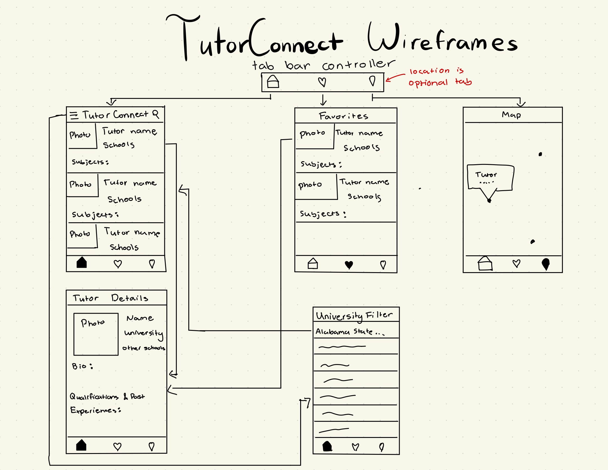

# TutorConnect 

## Table of Contents

1. [Overview](#Overview) 
2. [Product Spec](#Product-Spec)
3. [Wireframes](#Wireframes)
4. [Schema](#Schema)

## Overview

### Description

An iOS app that helps students quickly find and connect with local tutors based on subject expertise and school affiliation, using simple search and school data APIs for relevant results.

### App Evaluation
- **Category:** Education
- **Mobile:** This app allows tutors to connect with college students who want to tutor them. It provides a platform for tutors to post what subjects they are available to tutor, what middle school/high school they attended (so people from the same schools can be connected), their pay rate, their contact information, and their availbility. That way wenn parents are finding tutors for their children or a student is finding one for themself, they can easily search and apply a filter or a search to find the perfect tutor for them, and college students can work a part-time job. The app also shows a map, which shows the location of tutors on the map for convenience.
- **Story:** It can be hard for students to find tutors that match their needs and also provides a platform where college students can easily work a part-time job. Allows for parents, students, and tutors to save time when searching.
- **Market:** The audience includes college students, and elementary/middle/high school students in need of tutoring, and parents. Many tutoring websites and apps exist, but this app would allows for peer-to-peer tutoring in an accessible and affordable way with tutors from specific schools and specializations. 
- **Habit:** Users would use the app when they are in search of tutor, and tutors would use the app when they want to add/update their profile. Users can create and consume content.
- **Scope:** Adding maps and locations with API integration is optional but manageable. V1 would include the basic add tutor feature and display the list of current tutors, as well as a list of their favorite tutor profiles they are looking at. V2 would include a filter and search feature. V3 would include an integration of maps and locations. V4 would inlcude a chatbox or a way to email the tutors directly from the app, or send the students profile to the tutor. 

## Product Spec

### 1. User Stories (Required and Optional)

**Required Must-have Stories**

* User can add a tutor posting
* User can favorite tutor profiles they like
* User can search the profiles with keywords

**Optional Nice-to-have Stories**

* Users can filter based on university
* Users can view a map with the location of nearby tutors

### 2. Screen Archetypes

- [ ] Home Screen
* User can view a current overview of tutor profiles that are posted
* Users can use a search bar to narrow their search
* Each profile displays there name, subjects they tutor, and schools they go to / went to
- [ ] Profile Screen
* Users can view more information about each tutor when there profile is clicked. 
* Displays their name, subjects, university, middle, and high schools, and short bio, and qualifications / past relevant experiences
- [ ] Creation
* Users can add a new tutor listing to the screen
- [ ] Favorites Screen
* Users can view the tutor profiles they have favorited.
- [ ] Map Screen
* Users can view a map with the locations of tutors that are nearby to their own location

### 3. Navigation

**Tab Navigation** (Tab to Screen)

* Home Screen
* Favorites Tab
* Map View

**Flow Navigation** (Screen to Screen)

- [ ] Home Screen
* => Creation Screen
* => Profile Screen

## Wireframes

 

### [BONUS] Digital Wireframes & Mockups

### [BONUS] Interactive Prototype

## Schema 

[This section will be completed in Unit 9]

### Models

[Add table of models]

### Networking

- [Add list of network requests by screen ]
- [Create basic snippets for each Parse network request]
- [OPTIONAL: List endpoints if using existing API such as Yelp]
